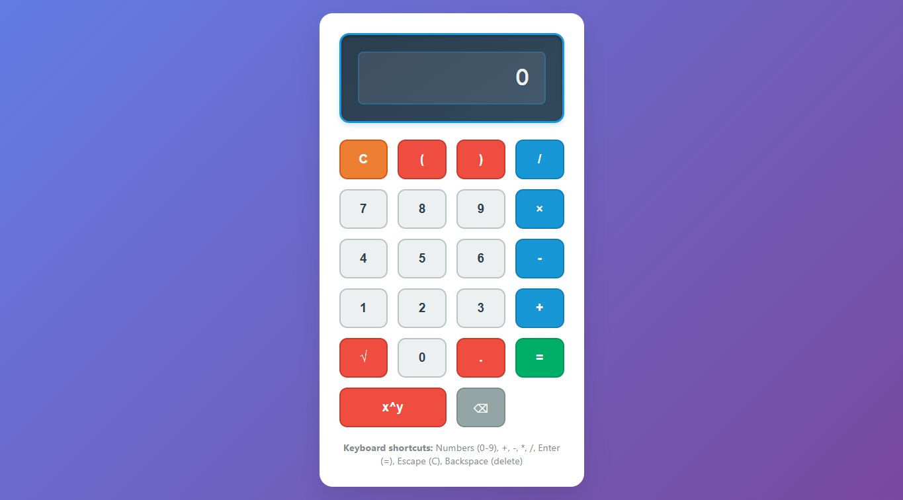

# 🧮 Scientific Calculator


A beginner-friendly browser-based scientific calculator built with HTML, CSS, and JavaScript. This project supports basic arithmetic operations, parentheses, square root, and power functions with a modern, responsive design.

## 📸 Screenshots

<div align="center">
  
  <p><em>Modern scientific calculator with gradient background and intuitive button layout</em></p>
</div>

## 🚀 Live Demo

[View Live Scientific Calculator](https://scientific-calculator-shibam.netlify.app/)

## 📁 Project Structure

```
scientific-calculator-shibam/
├── 📄 index.html          # Main HTML file with calculator layout
├── 🎨 styles.css          # CSS styling for design and animations
├── ⚡ calc.js             # JavaScript logic for calculator functionality
├── 📸 screenshot/         # Project screenshots
│   └── scientific-calculator-shibam.png
├── 📖 README.md           # Project documentation (this file)
├── 📜 LICENSE             # MIT License file
└── 🚫 .gitignore          # Git ignore file
```

## 🛠️ Technologies Used

<table>
<tr>
<td align="center"><br><b>HTML5</b></td>
<td align="center"><br><b>CSS3</b></td>
<td align="center"><br><b>JavaScript</b></td>
</tr>
</table>

## 📝 Commit History

This project was developed through 5 key commits:

1. **init** - Initial project setup and basic file structure
2. **layout** - HTML structure and CSS styling for calculator interface
3. **core logic** - JavaScript implementation for calculation functionality
4. **keyboard support** - Added keyboard input support and shortcuts
5. **docs** - Documentation updates and project finalization

## ✨ Features

- **Basic Operations**: Addition (+), Subtraction (-), Multiplication (×), Division (/)
- **Advanced Functions**: Square root (√), Power (x^y), Parentheses for grouping
- **Interactive Interface**: On-screen keypad with visual feedback and hover effects
- **Keyboard Support**: Full keyboard input support for faster calculations
- **Error Handling**: Input validation and error display with animations
- **Responsive Design**: Works perfectly on desktop, tablet, and mobile devices
- **Modern UI**: Beautiful gradient background with smooth button animations

## 🚀 How to Run

This is a pure HTML/CSS/JavaScript project that runs directly in the browser:

1. **Download/Clone** the project files
2. **Open** `index.html` in any modern web browser
3. **Start calculating** using either the on-screen buttons or keyboard shortcuts

**No installation, build process, or server required!**

## ⌨️ Keyboard Shortcuts

| Key | Function |
|-----|----------|
| `0-9` | Number input |
| `+` `-` `*` `/` | Basic operations |
| `(` `)` | Parentheses |
| `.` | Decimal point |
| `Enter` or `=` | Calculate result |
| `Escape` | Clear all |
| `Backspace` | Delete last character |

## 🧪 Test Cases

Try these examples to test the calculator:

### Basic Arithmetic
- `2 + 2` = 4
- `10 - 3` = 7
- `6 × 7` = 42
- `15 / 3` = 5

### Advanced Operations
- `√16` = 4 (click √ button then 16)
- `2^3` = 8 (enter 2, click x^y, enter 3)
- `(2 + 3) × 4` = 20
- `2 + 3 × 4` = 14 (follows order of operations)

### Complex Expressions
- `√(25) + 3^2` = 14
- `(10 + 5) / (3 × 1)` = 5
- `2.5 × 4.2` = 10.5

## 🛠️ Technical Implementation

### File Overview
- **`index.html`**: Contains the calculator structure with display and button grid
- **`styles.css`**: Handles all styling, animations, and responsive design
- **`calc.js`**: Manages calculator logic, input handling, and calculations

### Key Functions (calc.js)
- `addNumber()` - Adds numbers and operators to expression
- `calculate()` - Performs the calculation using eval()
- `clearAll()` - Resets the calculator
- `addSquareRoot()` - Adds square root function
- `addPower()` - Adds power operation
- `deleteOne()` - Removes last character

### Security & Safety
This calculator uses `eval()` for expression evaluation, which is acceptable for this beginner project because:
- Input is cleaned and sanitized before evaluation
- Only safe mathematical characters are allowed
- Parentheses are validated for proper balance
- Comprehensive error handling prevents issues

## 🌐 Browser Compatibility

- ✅ Chrome 60+
- ✅ Firefox 55+
- ✅ Safari 12+
- ✅ Edge 79+

## 📱 Responsive Design

The calculator automatically adapts to different screen sizes:
- **Desktop**: Full-size buttons and display
- **Tablet**: Medium-sized interface
- **Mobile**: Compact layout optimized for touch

## 🎨 Design Features

- **Gradient Background**: Beautiful blue-purple gradient
- **Button Animations**: Hover and click effects
- **Error Handling**: Red shake animation for errors
- **Success Feedback**: Green pulse animation for successful calculations
- **Modern Typography**: Clean, readable fonts

## 🔧 Development Notes

This project was built as a beginner-friendly learning exercise focusing on:
- Clean, commented code for easy understanding
- Separation of concerns (HTML structure, CSS styling, JS logic)
- Responsive web design principles
- Basic JavaScript DOM manipulation
- CSS animations and transitions

## 📄 License

This project is licensed under the MIT License - see the [LICENSE](LICENSE) file for details.

This project is open source and available for educational purposes.